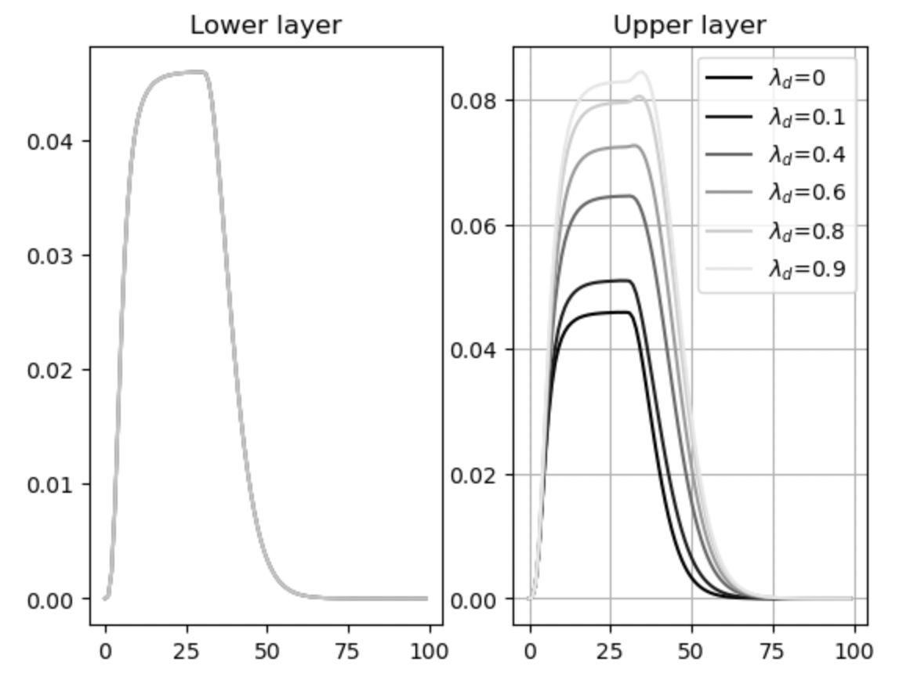
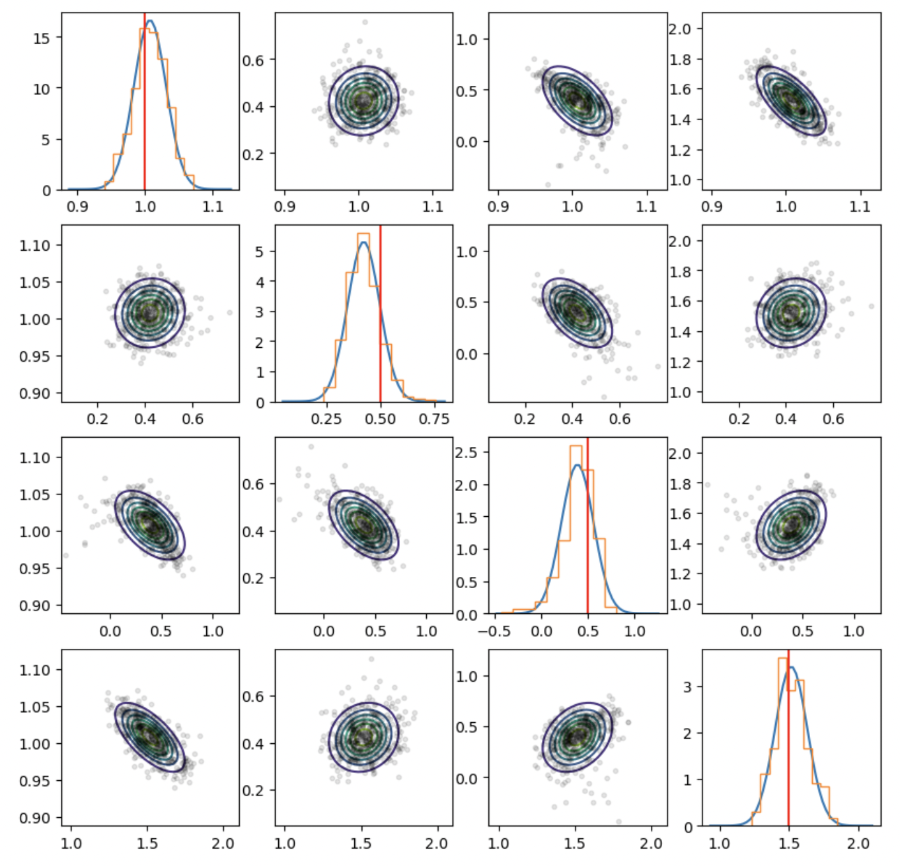

# dcsem

This library implements DCM and SEM for FMRI data. In addition, it implements "Layers" versions of both.


## Getting started

Clone the repo and install
```commandline
git clone https://git.fmrib.ox.ac.uk/saad/dcsem.git
cd dcsem
pip install -e .
```

## Usage

### Simulating data using DCM generative model
In the below example, we create a simple two-ROI DCM model. 
```python
import numpy as np
from dcsem import models, utils
# input
tvec  = np.arange(100) # time vector (seconds)
u     = utils.stim_boxcar(np.array([[0,10,1]])) # stimulus function (here onset=0, duration=10s, magnitude=1)

# connectivity params
num_rois = 2
num_layers = 1
# roi0,layer0->roi1,layer0 : magnitude = 0.2
# 
connections = ['R0,L0 -> R1,L0 = .2']
A = utils.create_A_matrix(num_rois,
                          num_layers,
                          connections,
                          self_connections=-1)
# input->roi0,layer0 : c=1
input_connections = ['R0, L0 = 1.']
C = utils.create_C_matrix(num_rois, num_layers,input_connections)

# instantiate object
dcm = models.DCM(num_rois, params={'A':A,'C':C})

# run simulation
state_tc = dcm.simulate(tvec, u)

# plot results
import matplotlib.pyplot as plt
plt.plot(tvec, state_tc['bold'])
```

Below is how you can generate data for layer DCM. We generate a 1 ROI layer DCM, and we change the value of the blood draining parameter $\lambda_d$ (see theory section) and examine its effect on the activity in the two layers (replicating the result from Heinzle et al, figure 2c).

```python
from dcsem import models, utils
TR    = 1  # repetition time
ntime = 100  # number of time points 
tvec  = np.linspace(0,ntime*TR,ntime)  # seconds

stim = [[0,30,1]]
u    = utils.stim_boxcar(stim)

# 1 ROI
A = utils.create_A_matrix(num_rois=1, num_layers=2, self_connections=-1.)
C = utils.create_C_matrix(num_rois=1, num_layers=2, input_connections=['R0,L0=1.','R0,L1=1.'])

state_tc = []
lambdas = [0,0.1,0.4,0.6,0.8,0.9] 
for l in lambdas:
    ldcm = models.TwoLayerDCM(num_rois=1, params={'A':A, 'C':C, 'l_d':l})
    state_tc.append(ldcm.simulate(tvec,u))

# Plotting
import matplotlib.pyplot as plt
plt.figure()
for s,l in zip(state_tc,lambdas):
    plt.subplot(1,2,1)
    plt.plot(s['bold'][:,0],c=[l,l,l],alpha=.5)
    plt.title('Lower layer')    
    plt.subplot(1,2,2)
    plt.title('Upper layer')    
    plt.plot(s['bold'][:,1],c=[l,l,l],label=f'$\lambda_d$={l}')
    plt.legend()

plt.grid()
plt.show()
```
Effect of changing $\lambda_d$ on the BOLD activity in the upper layer.



### Simulating and fitting data with a Layer SEM

The API of the MultiLayerSEM class is quite similar to DCM, except we don't have an input (the input is random noise).

In the below example, we simulate a 2 ROI, 3 layer model and we fit the parameters to the simulated data and plot the posterior distributions.

```python
from dcsem import models, utils
import numpy as np
num_rois   = 2
num_layers = 3
A = utils.create_A_matrix(num_rois,num_layers,
                          ['R0,L2 -> R1,L1 = 1.5',
                           'R1,L0 -> R0,L0 = 0.5',
                           'R1,L2 -> R0,L0 = 0.5'])
sigma = 1.
lsem  = models.MultiLayerSEM(num_rois,num_layers,params={'A':A, 'sigma':sigma})
TIs   = [400, 600, 800, 1000] # inversion times
y     = lsem.simulate_IR(tvec, TIs)
tvec  = np.linspace(0,1,100)
res   = lsem.fit_IR(tvec, y, TIs)
```
Now plot the posterior distributions:

```python
# Compare fitted to simulated params
ground_truth  = lsem.p_from_A_sigma( A, sigma )
estimated     = res.x
estimated_cov = res.cov
fig = utils.plot_posterior(estimated, estimated_cov, samples=res.samples, actual=ground_truth)
```

You should obtain something like the below:




### Implementation of DCM for layer FMRI

Based on [Heinzle et al. Neuroimage 2016](https://www.sciencedirect.com/science/article/pii/S1053811915009350)

The traditional DCM model is composed of two elements, a state equation describing the evolution of neuronal dynamics $x(t)$ as a function of an input stimulus $u(t)$, and an equation linking neural dynamics to the BOLD signal $y(t)$ via the Buxton Balloon model (see [Buxton and Frank. 1997](https://pubmed.ncbi.nlm.nih.gov/8978388/) and [Friston et al. 2000](https://www.sciencedirect.com/science/article/pii/S105381190090630X)). The state equation is a simple order 1 ODE:

$$ \frac{dx}{dt}=Ax(t)+Cu(t) $$

Where $A$ is a $n\times n$ connectivity matrix between $n$ regions of interest and $C$ is a $n \times 1$ matrix specifying how the input feeds into each region.

The Balloon model relates neural activity to the BOLD signal change via a neuro-vascular coupling mechanism involving 4 state variables: $s(t)$ is a vasodilatory signal which links neural activity to changes in blood flow $f(t)$; this in turn is coupled with changes in blood volume $v(t)$ and in deoxy-hemoglobin (dHb) $q(t)$ via a nonlinear ODE:

$$
\begin{array}{rcl}
\frac{ds}{dt} & = &-\kappa s -\gamma (f-1) + x \\
\frac{df}{dt} & = &s \\
\tau\frac{dv}{dt} & = &-v^{1/\alpha}+f \\
\tau\frac{dq}{dt} & = &-\frac{v^{1/\alpha}}{v}q+f\frac{1-(1-E_0)^{1/f}}{E_0}
\end{array}
$$

Finally, the BOLD signal change is a nonlinear combination of changes in blood flow and dHb concentration:

$$y(t) = V_0\left(k_1(1-q)+k_2(1-\frac{q}{v})+k_3(1-v)\right)$$

Note: in Heinzle2016, the model has been slightly re-parametrised compared to Friston2000, here is the mapping between the two:

$$
\begin{array}{rcl}
\textrm{Heinzle} & - & \textrm{Friston} \\
\kappa & \Longleftrightarrow & 1/\tau_s \\
\gamma & \Longleftrightarrow & 1/\tau_f \\
\tau & \Longleftrightarrow & \tau_0.
\end{array}
$$

### Two-Layer extension 
Extending the model to incorporate multiple layers can be straightforwardly done by considering each layer as its own region, but we would like to additionally model the effect of venous blood flowing up towards the pial surface. This is achieved using two additional state variables $v_s(t), q_s(t)$ (volume and dHB concentration) which have the following dynamics:

$$ 
\begin{array}{rcl}
\tau_d\frac{dv_s}{dt} & = & -v_s + (1-v_l)  \\
\tau_d\frac{dq_s}{dt} & = & -q_s + (1-q_l)  
\end{array}
$$

where $v_l$ and $q_l$ are volume/dHb state parameters of the ower layer. These equation mean changes in blood volume/dHb in lower layers drive the blood draining signal. 

The state equations for the upper layer dynamics are slightly different to the standard balloon model, with the addition of fthe two new state variables:

$$ 
\begin{array}{rcl}
\tau\frac{dv_u}{dt} & = & -v_u^{1/\alpha} + f_u + \lambda_d v_s  \\
\tau\frac{dq_u}{dt} & = & -\frac{v_u^{1/\alpha}}{v_u}q_u+f_u\frac{1-(1-E_0)^{1/f_u}}{E_0} + \lambda_d q_s 
\end{array}
$$

## SEM and Layer SEM


Structural Equation Model:

$$ x = Ax + u, $$

where $u$ is $N(0,\sigma^2)$. 

This implies: $x=(I-A)^{-1}(u)$, which is the generative model.

The covariance implied by the model is $C=\sigma^2 (I-A)^{-1}(I-A)^{-T}$, which is to be compared to the empirical covariance $S=cov(x)$.

For Layer SEM, the same equation applies, but the observations are of the form:

$$ y_k=P_k x, $$

where $\{P_k\}$ are partial volume matrices that combine signals from different layers. Combined with the generative equation for $x$ we have:

$y_k = P_k (I-A)^{-1}(u)$

and therefore $C_k = \sigma^2  P_k(I-A)^{-1}(I-A)^{-T} P_k^T$.


