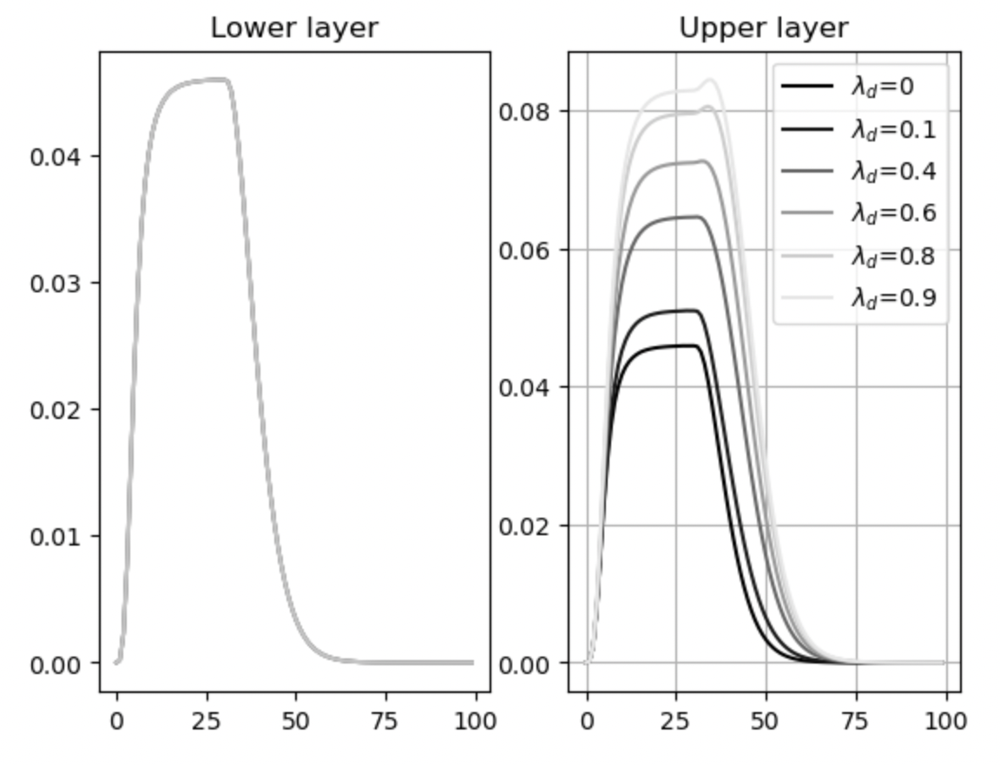
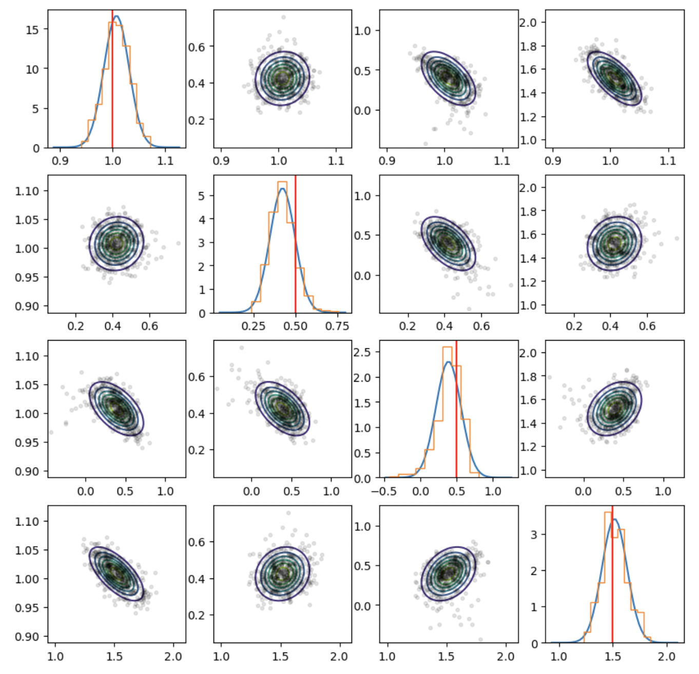

# dcsem

This library implements DCM and SEM for FMRI data. In addition, it implements "Layers" versions of both.


## Getting started

Clone the repo and install. The project uses `uv` for environment management:

```bash
git clone https://git.fmrib.ox.ac.uk/saad/dcsem.git
cd dcsem
uv sync                              # creates .venv, installs deps
uv run pytest dcsem/tests/ -v        # smoke check
```

`pip install -e .` works too if you prefer to manage the venv yourself.

## Usage

### Using the command-line wrappers
The easiest way to run the simulations is by using the command line wrapper tools `dcsem_sim` and `dcsem_fit` (BUT: `dcsem_fit` has not yet been implemented).

To get the usage, simply type:

```bash
dcsem_sim --help
```

It is best to run the simulator using a configuration file which defines all the parameters. Here is an example which simulates a DCM model with 3 regions and 2 layers per region:

```bash
# Comments are ignored
outdir = /path/to/output/folder

# Model
model = DCM 

# Network definitions:
num_rois = 3
num_layers = 2
Amat = /path/to/Amat.txt
Cmat = /path/to/Cmat.txt

# Time series params
time_points = 200  
tr = 0.72 
cnr = 20

# Stimulus
stim = /path/to/simulus.txt
```
Once the configuration file has been created, you can run the simulation using:

```bash
dcsem_sim --config my_configuration.txt
```

### Defining the connectivity matrices A and C
The files `Amat.txt` and `Cmat.txt` required to run the simulations can have two different formats. They can either be explicitly given or they can be "described" (see below).

For example, the network shown below has two ROIs with connectivity between the upper and lower layers between the ROIs.

The corresponding connectivity matrix (assuming all connection parameters equal 1 and self-connections equal -1) is:

```bash
echo -1  0  0  0  > Amat.txt
echo  0 -1  0  0 >> Amat.txt
echo  0  1 -1  0 >> Amat.txt
echo  1  0  0 -1 >> Amat.txt
```

The same info could be given with the following text file:

```text
R0, L0 -> R1, L1 = 1
R1, L0 -> R0, L1 = 1
```
The self connections can also be added to the above for each roi and layer, or it can be included in the command-line interface using the `--self_conn` flag.


### Using the python interface

The simulations can also be directly run using the python interface. In the below example, we create a simple two-ROI DCM model. 
```python
import numpy as np
from dcsem import models, utils
# input
tvec  = np.arange(100) # time vector (seconds)
u     = utils.stim_boxcar(np.array([[0,10,1]])) # stimulus function (here onset=0, duration=10s, magnitude=1)

# connectivity params
num_rois = 2
num_layers = 1
# roi0,layer0->roi1,layer0 : magnitude = 0.2
# 
connections = ['R0,L0 -> R1,L0 = .2']
A = utils.create_A_matrix(num_rois,
                          num_layers,
                          connections,
                          self_connections=-1)
# input->roi0,layer0 : c=1
input_connections = ['R0, L0 = 1.']
C = utils.create_C_matrix(num_rois, num_layers,input_connections)

# instantiate object
dcm = models.DCM(num_rois, params={'A':A,'C':C})

# run simulation
bold, state_tc = dcm.simulate(tvec, u)

# plot results
import matplotlib.pyplot as plt
plt.plot(tvec, bold)
```

#### Fitting a DCM

For deterministic DCMs, `method="NL"` now uses bounded `L-BFGS-B` rather than unconstrained Nelder-Mead. The fit objective is a Gaussian negative log-likelihood on the BOLD residuals. If `noise_std` is omitted, the residual variance is estimated from the current residual energy.

```python
res = dcm.fit(bold, tvec=tvec, u=u, method="NL", noise_std=0.02)
print(res.x)                  # fitted parameters
print(res.se)                 # local standard errors from Hessian curvature
print(res.cov_is_calibrated)  # True for proper neg-log-likelihood fits
```

The nonlinear fitter enforces negative self-connections and positive hemodynamic parameters. If a parameter set is unstable or produces invalid trajectories, it is penalized rather than treated as a valid fit.

Below is how you can generate data for layer DCM. We generate a 1 ROI layer DCM, and we change the value of the blood draining parameter $\lambda_d$ (see theory section) and examine its effect on the activity in the two layers (replicating the result from Heinzle et al, figure 2c).

```python
from dcsem import models, utils
TR    = 1  # repetition time
ntime = 100  # number of time points 
tvec  = np.linspace(0,ntime*TR,ntime)  # seconds

stim = [[0,30,1]]
u    = utils.stim_boxcar(stim)

# 1 ROI
A = utils.create_A_matrix(num_rois=1, num_layers=2, self_connections=-1.)
C = utils.create_C_matrix(num_rois=1, num_layers=2, input_connections=['R0,L0=1.','R0,L1=1.'])

bold_tc = []
lambdas = [0,0.1,0.4,0.6,0.8,0.9] 
for l in lambdas:
    ldcm = models.TwoLayerDCM(num_rois=1, params={'A':A, 'C':C, 'l_d':l})
    bold_tc.append(ldcm.simulate(tvec,u)[0])

# Plotting
import matplotlib.pyplot as plt
plt.figure()
for s,l in zip(bold_tc,lambdas):
    plt.subplot(1,2,1)
    plt.plot(s[:,0],c=[l,l,l],alpha=.5)
    plt.title('Lower layer')    
    plt.subplot(1,2,2)
    plt.title('Upper layer')    
    plt.plot(s[:,1],c=[l,l,l],label=f'$\lambda_d$={l}')
    plt.legend()

plt.grid()
plt.show()
```
Effect of changing $\lambda_d$ on the BOLD activity in the upper layer.



### Simulating and fitting data with a Layer SEM

The API of the MultiLayerSEM class is quite similar to DCM, except we don't have an input (the input is random noise) and there are no self-connections.

In the below example, we simulate a 2 ROI, 3 layer model and we fit the parameters to the simulated data and plot the posterior distributions.

```python
from dcsem import models, utils
import numpy as np
num_rois   = 2
num_layers = 3
A = utils.create_A_matrix(num_rois,num_layers,
                          ['R0,L2 -> R1,L1 = 1.5',
                           'R1,L0 -> R0,L0 = 0.5',
                           'R1,L2 -> R0,L0 = 0.5'])
sigma = 1.
lsem  = models.MultiLayerSEM(num_rois,num_layers,params={'A':A, 'sigma':sigma})
TIs   = [400, 600, 800, 1000] # inversion times
y     = lsem.simulate_IR(tvec, TIs)
tvec  = np.linspace(0,1,100)
res   = lsem.fit_IR(tvec, y, TIs)
```
Now plot the posterior distributions:

```python
# Compare fitted to simulated params
ground_truth  = lsem.p_from_A_sigma( A, sigma )
estimated     = res.x
estimated_cov = res.cov
fig = utils.plot_posterior(estimated, estimated_cov, samples=res.samples, actual=ground_truth)
```

You should obtain something like the below:




### Implementation of DCM for layer FMRI

The theory below is based on [Heinzle et al. Neuroimage 2016](https://www.sciencedirect.com/science/article/pii/S1053811915009350)

The traditional DCM model is composed of two elements, a state equation describing the evolution of neuronal dynamics $x(t)$ as a function of an input stimulus $u(t)$, and an equation linking neural dynamics to the BOLD signal $y(t)$ via the Buxton Balloon model (see [Buxton and Frank. 1997](https://pubmed.ncbi.nlm.nih.gov/8978388/) and [Friston et al. 2000](https://www.sciencedirect.com/science/article/pii/S105381190090630X)). The state equation is a simple order 1 ODE:

$$ \frac{dx}{dt}=Ax(t)+Cu(t) $$

Where $A$ is a $n\times n$ connectivity matrix between $n$ regions of interest and $C$ is a $n \times 1$ matrix specifying how the input feeds into each region.

The Balloon model relates neural activity to the BOLD signal change via a neuro-vascular coupling mechanism involving 4 state variables: $s(t)$ is a vasodilatory signal which links neural activity to changes in blood flow $f(t)$; this in turn is coupled with changes in blood volume $v(t)$ and in deoxy-hemoglobin (dHb) $q(t)$ via a nonlinear ODE:

$$
\begin{array}{rcl}
\frac{ds}{dt} & = &-\kappa s -\gamma (f-1) + x \\
\frac{df}{dt} & = &s \\
\tau\frac{dv}{dt} & = &-v^{1/\alpha}+f \\
\tau\frac{dq}{dt} & = &-\frac{v^{1/\alpha}}{v}q+f\frac{1-(1-E_0)^{1/f}}{E_0}
\end{array}
$$

Finally, the BOLD signal change is a nonlinear combination of changes in blood flow and dHb concentration:

$$y(t) = V_0\left(k_1(1-q)+k_2(1-\frac{q}{v})+k_3(1-v)\right)$$

Note: in Heinzle2016, the model has been slightly re-parametrised compared to Friston2000, here is the mapping between the two:

$$
\begin{array}{rcl}
\textrm{Heinzle} & - & \textrm{Friston} \\
\kappa & \Longleftrightarrow & 1/\tau_s \\
\gamma & \Longleftrightarrow & 1/\tau_f \\
\tau & \Longleftrightarrow & \tau_0.
\end{array}
$$

### Multi-Layer extension 
Extending the model to incorporate multiple layers can be straightforwardly done by considering each layer as its own region, but (as in Heinzle et al.) we would like to additionally model the effect of venous blood flowing up towards the pial surface. This is achieved using two additional state variables (per layer) $v^{\star}_k(t), q^{\star}_k(t)$ (volume and dHB concentration) which have the following dynamics:

$$ 
\begin{array}{rcl}
\tau_d\frac{dv^{\star}_{k}}{dt} & = & -v^{\star}_{k} + (1-v_{k-1})  \\
\tau_d\frac{dq^{\star}_{k}}{dt} & = & -q^{\star}_{k} + (1-q_{k-1})  
\end{array}
$$

where $v_{k-1}$ and $q_{k-1}$ are volume/dHb state parameters of the layer below layer $k$ (Sorry, I am labelling layers going from white matter to pial surface, which is obviously the wrong way round!). These equation mean changes in blood volume/dHb in lower layers drive the blood draining signal. 

The state equations for the layer dynamics are slightly different to the standard balloon model, with the addition of the two new state variables added to all but the first layer:

$$ 
\begin{array}{rcl}
\tau\frac{dv_k}{dt} & = & -v_k^{1/\alpha} + f_k + \lambda_d v^{\star}_{k}  \\
\tau\frac{dq_k}{dt} & = & -\frac{v_k^{1/\alpha}}{v_u}q_k+f_k\frac{1-(1-E_0)^{1/f_k}}{E_0} + \lambda_d q^{\star}_{k} 
\end{array}
$$

## Spectral DCM

The package also includes a simplified linear stochastic spectral DCM implementation in `dcsem.spectral.SpectralDCM`. This is an LS-spDCM approximation, not a full SPM-style spectral DCM. Its key assumptions are:

- linear neural dynamics with white, ROI-independent innovations
- a shared fixed HRF across ROIs
- stationarity of the observed BOLD signal
- Welch-estimated cross-spectral density as the observation target

The public helpers `get_param_names()` and `get_bounds()` expose the expected parameter layout for a given number of ROIs:

```python
from dcsem import SpectralDCM

spdcm = SpectralDCM(n_rois=2, TR=1.0)
print(spdcm.get_param_names())  # ['a01', 'a10', 'log_sigma_e']
print(spdcm.get_bounds())       # default optimization bounds
```

The standalone scripts `scripts/pipelines/spdcm_generic.py`, `scripts/pipelines/spdcm_mcmc_generic.py`, and `scripts/experimentation/spdcm_noise_sweep.py` use the same parameter metadata. When fitting empirical BOLD, the safest workflow is to check that the time series is approximately stationary and that the fitted `A` matrix remains stable.


## Inversion pipelines

Four production scripts under `scripts/pipelines/` invert (sp)DCM and analytical
models on synthetic or empirical BOLD. Each wraps its work in `run_single(cfg)` /
`run_single_mcmc(cfg)` with a `RunConfig` dataclass.

| Script | Method | Data target |
|---|---|---|
| `inversion_generic.py` | L-BFGS-B | time-domain BOLD |
| `mcmc_generic.py` | emcee MCMC | time-domain BOLD |
| `spdcm_generic.py` | L-BFGS-B | cross-spectral density (LS-spDCM) |
| `spdcm_mcmc_generic.py` | emcee MCMC | cross-spectral density (LS-spDCM) |

Each pipeline writes a `run_results.npz` artifact under `results/images/...`
with a uniform schema across methods: `y_obs`, `y_pred`, `theta_est`,
`theta_true`, `theta_zero`, `se`, `ci`, `cov`, `hess_cond`,
`cov_is_calibrated`, `hess_is_near_singular`, `converged`, plus method-specific
diagnostics (`acceptance_fraction`, `ess_total` for MCMC).

Cell-by-cell counterparts under `scripts/playground/` mirror the production
bodies with `# %%` markers — open one in VS Code's Interactive Window or
Jupyter to step through each stage and inspect intermediate state.

### Picking a model

Time-domain pipelines pick from `MODEL_REGISTRY` by name (`quadratic`,
`product_degen`, `michaelis_menten`, `logistic_sigmoid`, `power_law`,
`sum_of_exponentials`, `dcm_2roi`):

```python
from scripts.pipelines.inversion_generic import RunConfig, run_single
run_single(RunConfig(model_name="dcm_2roi", seed=42))
```

Spectral pipelines accept the model dimension directly:

```python
from scripts.pipelines.spdcm_generic import RunConfig, run_single
run_single(RunConfig(n_rois=2, TR=1.0, data_mode="synthetic_csd", snr=10.0))
```

`data_mode` selects the simulation path: `"synthetic_csd"` (fast, default),
`"synthetic_bold"` (slow, requires `sdeint`), or `"empirical"` (needs `bold_path`
pointing at an NPZ with `bold: float32 (T, R)` and optional `TR: float`).

### DCM 2-ROI parameter conventions

| Param | Meaning | Typical range |
|---|---|---|
| `a01`, `a10` | Inter-ROI connection strengths (excitatory `+`, inhibitory `−`) | `[-1.5, 1.5]` |
| `c0`, `c1` | Stimulus → ROI inputs | `[0, 1.5]` |
| `log_sigma_e` | Log of innovation noise SD (spDCM only) | `[-5, 0]` |

### Diagnostics

- **`cov_is_calibrated = False`** — the Hessian was indefinite or singular at
  the optimum. The run still completed, but Hessian-derived standard errors
  are unreliable; treat them as ordinal.
- **MCMC convergence** — `dcsem.utils.is_chain_converged(acc_frac, eff_total,
  n_params)` is the shared helper. Healthy bands: acceptance ∈ [0.15, 0.80]
  and ESS > 50·n_params.
- **DCM stiffness** — use `ode_method="BDF"` (the registry default) when
  simulating time-domain BOLD; default Runge-Kutta can blow up on stiff
  parameter sets.

## Identifiability and PCA validation for BENCH

The 2-ROI deterministic DCM with free parameters `{a01, a10, c0, c1}` was
analysed for structural identifiability via the forward-model Fisher
Information Matrix (FIM). At each of 200 random baselines drawn uniformly
from `PARAM_BOUNDS`, the central-difference Jacobian `∂BOLD/∂θ` was
computed and the FIM `J'J / σ²` formed (noise σ from
`NOISE_CONFIG.get_noise_std`). Driver: `scripts/workflows/08-identifiability_analysis.py`.

**Identifiability findings** (run 2026-05-10):

- All four parameters are structurally identifiable at every tested baseline
  (smallest FIM eigenvalue stays above the 1e-6 floor).
- FIM eigenvalue spread spans ~4× on average (9.5e6 to 4.0e7) — moderately
  sloppy but invertible.
- Median FIM condition number ~26 500; worst-case ~3.1e9 (a small fraction
  of baselines is severely ill-conditioned). The least-identifiable direction
  is dominated by `a10` (loading +0.748) with anti-correlated `c1` (-0.493) —
  i.e. trade-offs between an upstream connection and the corresponding input.

**PCA-as-summary validation for BENCH** (the open methodological item from
the March 2026 review):

The BENCH pipeline (`scripts/workflows/05-apply_bench.py`) compresses the
forward simulation into the top-k principal components of BOLD across 5000
prior-sampled simulations. We checked whether this PCA basis preserves the
parameter-space directions that the FIM identifies as informative, by
projecting Jacobians: `J_pca = V_k' · J`, then measuring rank and
condition number of `J_pca`.

| `n_components` | Projected Jacobian full-rank | Median condition number |
|---|---|---|
| 3 | 0% of baselines (rank-deficient) | 33.5 |
| 4 | 100% | 644 |
| 5 | 100% | 452 |
| 6 | 100% | 219 |

Four PCA components is the minimum that preserves discriminability across
all four DCM parameters — which justifies the `n_comps=4` default in
`05-apply_bench.py`. With three components the projected Jacobian collapses
to rank 3 in every tested baseline, meaning at least one parameter
direction is invisible to BENCH. Increasing `n_components` beyond 4 only
reduces the condition number of the projection; the rank ceiling is set by
the parameter dimension.

Figures: `results/images/identifiability/{fim_eigenvalue_spectrum,
fim_correlation, bold_sensitivity}.png`. This closes the item flagged in
the March 2026 review (PCA validation via Jacobian projection).


## SEM and Layer SEM

Structural Equation Modelling is a non-dynamic model where activity in different regions are related through the equation:

$$ x = Ax + u, $$

where the non-zero elements of $A$ determine the structure of the model and where $u$ is $N(0,\sigma^2)$. The matrix $A$ controls how the noise propagates through the rois 

The above equation implies: $x=(I-A)^{-1}(u)$, which is the generative model.

The covariance implied by the model is $C=\sigma^2 (I-A)^{-1}(I-A)^{-T}$, which is to be compared to the empirical covariance $S=cov(x)$ in order to fit the free parameters (the non-zero elements of $A$ as well as the noise variance).

For Layer SEM, we simply consider each layer as its own region in the definition of the $A$ matrix (unlike the DCM model above, there is no BOLD, and there is no blood draining model). In the case where the data that we acquire is an Inversion-Recovery spin echo or gradient echo acquisition, and assuming that we are not measuring the signal from each region but rather from a T1-weighted linear combination of the layers, the observation equation is:

$$ y_k=P_k x, $$

where $\{P_k\}$ are partial volume matrices that combine signals from different layers. Combined with the generative equation for $x$ we have:

$y_k = P_k (I-A)^{-1}(u)$

and therefore $C_k = \sigma^2  P_k(I-A)^{-1}(I-A)^{-T} P_k^T$. These model convariances are compared to the observed covariances in order to fit the free parameters (again, these are the non-zero elements of $A$ and the noise variance).

